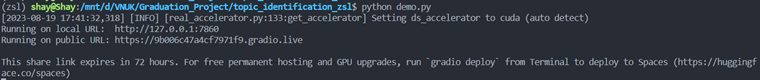
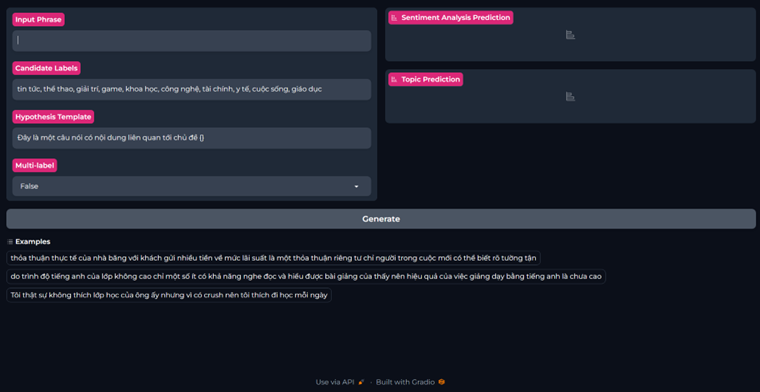

# Vietnamese Multi-Tasking Model for Sentiment Analysis in Educational Contexts and Topic Identification

This project aims to create a Vietnamese multi-tasking language model which be able to identify the general emotion (positive or negative) as well as the topic that the input sentence discussed about

# Installation

Create a virtual environment (Conda highly recommend). The Python version used for running this project is 3.9.16. Below is the example snipet using Anaconda to create environment:

```
conda create -n vi_mtl_project python=3.9.16
```

After creating new virtual environment, we first of all need to install PyTorch, which is the core package of this project. This project uses the PyTorch with CUDA 11.8, you can install with the following instructions:

```
pip install torch torchvision torchaudio --index-url --no-cache-dir https://download.pytorch.org/whl/cu118
```

Then, `cd vietnamese-mtl-model-for-sa-nli-tasks` and run the following commands:

```
pip install -r requirements.txt
```

Afterthat, download the [model](https://drive.google.com/file/d/1r4c_ITc7lkVDqBgxW3B_u9RN98nGuIKd/view?usp=sharing) here and extract it into `model\mtl_models` folder. 
# Testing
To start the application, navigate inside vietnamese-mtl-model-for-sa-nli-tasks folder and activate your installed environment above. Then simply run the following command in your terminal:

```python
python demo.py
```

You will see following logging description in your terminal:



This will open an application at your local port 7860 and you can access locally with this address: http://127.0.0.1:7860

You can also share the link to others by using the public URL below, just keep in mind this link will expire in 72 hours, after that time you will need to re-deploy it. After you access either local URL or public URL, here is the interface of the web:


